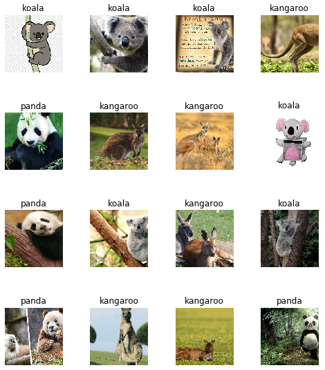
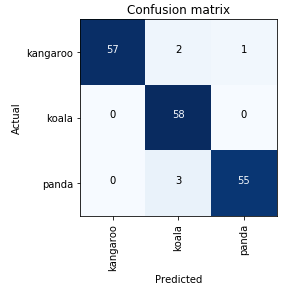
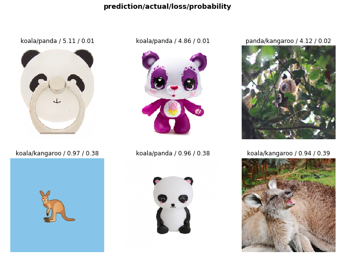

# Image classification of Google Images using Fastai v1
## How to quickly train an image classifier using images downloaded from the web

## Credit

This notebook is provided by Jeremy Howard's fastai [deep learning course](http://course.fast.ai/ "Fastai"). I've applied it to a new set of images downloaded from the web.

## Packages

This notebook uses the newly released fastai v1 library, which contains many useful data loading and computer vision functions.

## Motivation

If you want to train your own computer vision model, how do you go about getting all of the images you need and placing them in a folder structure that's expected by the model? This notebook walks through a clever way of grabbing the URL paths from Google Images and saving them as a .txt file. For this sample project, I downloaded about 300 images each of kangaroos, panda bears, and koalas. Then I read each category of image into its own folder and trained ResNet34 on the images.

## Files

The main file is **download_images-cpm.ipynb**, which walks through grabbing the URL paths from Google Images and then using ResNet34 to classify the images.

## Results

### How well did ResNet34 do on 3 classes of images?

The model only made 3 mistakes!

### Let's look at the 3 mistakes

Each of the three mistakes is much different than the typical nature shot of the animals. The first image looks like a computer-generated panda, the second is a t-shirt featuring a koala, and the final mistake was on a kid wearing a costume. These are all artifacts of doing a bulk pull from Google Images. If we wanted, we could easily clean up the data set to focus only on animals in the wild.
